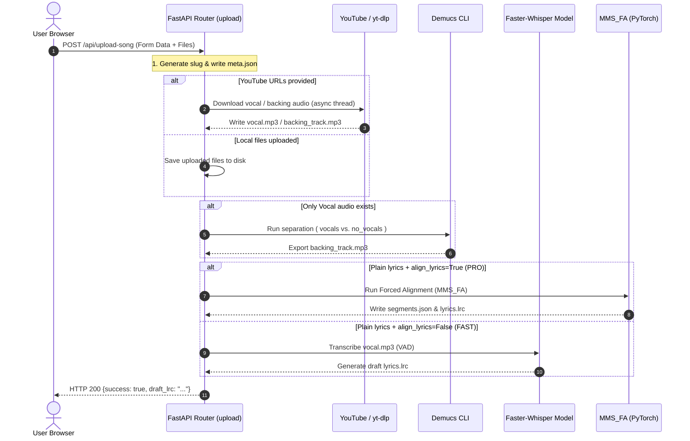

# 🔄 System Flow Documentation

This document describes the major user-facing flows and internal pipelines of the Karaoke AI system, detailing their step-by-step execution, sequence diagrams, and error paths.

---

## 1. Song Upload & Processing Pipeline

This flow covers adding a new song to the system, either by uploading local files or downloading them from YouTube, separating vocal and instrumental tracks via Demucs, transcribing vocals with Whisper, and generating word-level aligned segments.

### Step-by-Step Execution
1. **Form Submission:** The user fills the upload form in the client, providing the title, artist, language, and optionally local files (vocal, backing, LRC) or YouTube URLs.
2. **Metadata Creation:** The server generates a unique slug (e.g. `title-artist`) and creates the directory `server/songs/<slug>/`. It builds and saves a default `meta.json` with the song settings.
3. **File Retrieval:**
   - **Local Files:** If files are uploaded, they are saved directly to `vocal.mp3`, `backing_track.mp3`, and `lyrics.lrc`.
   - **YouTube Download:** If URLs are provided, the server executes `yt-dlp` in parallel thread threads (`asyncio.to_thread`) to download the audio streams as high-quality MP3s.
4. **Audio Separation (Optional Demucs):** If no backing track URL/file is provided, the server runs the Demucs command in a background thread to isolate vocals from the backing track:
   `demucs --two-stems vocals -d cuda -o demucs_output original.mp3`
5. **Lyric Generation & Alignment:**
   - **FAST mode:** If no plain lyrics are supplied, Whisper transcribes `vocal.mp3` and generates a draft `lyrics.lrc`.
   - **PRO mode (Forced Alignment):** If plain lyrics are supplied and `align_lyrics` is checked, the server runs MMS_FA using PyTorch/CUDA in a background thread to generate perfectly timed word-level timestamps.
   - **Whisper alignment (Fallback):** If MMS_FA fails or is skipped, the server uses a cursor forward-only matching algorithm to align the plain lyrics with the Whisper transcription stream.
6. **Segment Generation (prepare_song):** The final step parses `lyrics.lrc`, slices the audio in memory, transcribes segment-by-segment with Whisper (with expected text as `initial_prompt`), aligns word boundaries, enforces monotonic timestamp progression, and writes the `segments.json` file.

### Sequence Diagram


### Error Paths
- **YouTube Download Failure:** If `yt-dlp` fails (invalid URL or network error), the server logs the warning, checks if the target files exist, and returns `HTTP 500` if the audio files are missing.
- **Demucs Separation Error:** If the `demucs` command exits with a non-zero code or the output files are missing, the server logs the exception, cleans up temp files, and raises `HTTP 500`.
- **Forced Alignment Crash:** If PyTorch fails (e.g. out of VRAM), the server automatically catches the exception, logs it, and falls back to Whisper-based alignment or draft generation.

---

## 2. Song Reinstallation Pipeline

This flow allows re-running the processing pipeline for an already installed song, which is useful when updating the alignment settings or recreating files.

### Step-by-Step Execution
1. **Request:** Client triggers a reinstallation request: `POST /api/reinstall-song/{song_id}?align_lyrics=true`.
2. **Metadata Load:** Server reads `meta.json` in `server/songs/{song_id}/`.
3. **Backup Check:** Server preserves custom edits by copying the existing `lyrics.lrc` and `lyrics.txt` to memory/temporary backup variables. It also checks if a backup exists in `server/songs_backup/{song_id}` and restores it if available.
4. **Clean Folder:** If `clean_existing=True`, the server clears all files in the song directory except `meta.json`.
5. **Re-run Pipeline:** Re-executes the YouTube download, Demucs separation, Whisper/MMS_FA alignment, and `prepare_song` segmentation.
6. **Realign:** If `align_lyrics=True`, it performs global word-level realignment using syllabic weight interpolation to ensure the lyrics and segments are perfectly in sync.

### Error Paths
- **meta.json Missing:** Returns `HTTP 400` with details.
- **Alignment Error Fallback:** If alignment fails, the server restores the user's custom `lyrics.lrc` backup so their manual adjustments are not lost.

---

## 3. Manual Lyrics Editing & Realignment

This flow allows the user to manually edit a song's lyrics or metadata in the built-in LRC editor and realign the timestamps.

### Step-by-Step Execution
1. **Fetch:** Client requests lyrics: `GET /api/get-lyrics?slug={song_id}`. Server returns the contents of `lyrics.lrc`, `lyrics.txt`, and `meta.json`.
2. **Edit:** The user edits the tags, timestamps, or text in the browser.
3. **Save:** Client sends: `POST /api/save-lyrics` containing the updated LRC, language, and metadata JSON.
4. **Validation:** Server parses the new `meta_json` to verify it is valid JSON.
5. **Save to Disk:** Server normalizes line endings (`\r\n` to `\n`) and writes `lyrics.lrc`, `lyrics.txt`, and `meta.json` to the song folder.
6. **Regenerate Segments:** Server executes `run_prepare_song` in a background thread to slice the segments based on the new timestamps and write `segments.json`.

### Error Paths
- **JSON Syntax Error:** If the metadata is invalid JSON, the server aborts the save operation and returns `HTTP 400` with the syntax error description.
- **Prepare Song Failure:** If `prepare_song` fails, the error is caught, the LRC file is still saved, and the exception is logged.

---

## 4. WebSocket Game Loop Flow

This flow drives the real-time multiplayer singing and scoring game loop.

*For a detailed sequence diagram and analysis of player queueing, audio streaming, seeking, and game over persistence, please refer to the dedicated multiplayer flow document:*
👉 **[MULTIPLAYER_FLOW.md](file:///c:/Users/mf827/Documents/Ferramentas/karaoke/docs/architecture/MULTIPLAYER_FLOW.md)**

### Key States & Transitions
```
   [Disconnected]
          │
          │ (role=display)
          ▼
   [Display Paired] ◄──────────────────────┐
          │                                 │
          │ (role=mic, first in queue)      │ (All connections close)
          ▼                                 │
   [Mic Registering]                        │
          │                                 │
          │ (register_name success)         │
          ▼                                 │
   [Players Paired]                         │
          │                                 │
          │ (start_game)                    │
          ▼                                 │
    [Game Active]                           │
          │                                 │
          │ (audio_ended / exit)            │
          ▼                                 │
     [Game Over] ───────────────────────────┘
```

### Error Paths
- **Mic Client Disconnection mid-game:** The player is popped from `room.players` and `room.active_players`. The server broadcasts a `players_update` status.
- **Display Disconnection:** The server resets `room.display = None` and sends a `pairing_status: unpaired` message to all registered player microphones and waiting connections.
- **Transcription Task Exception:** If a background scoring task raises an exception (e.g., Whisper crashes), it is logged, and the segment's score defaults to `0.0` to prevent blocking the game loop.
