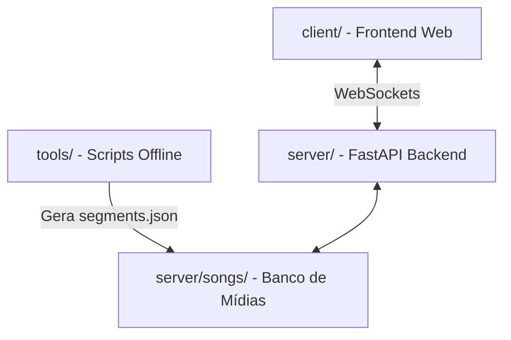

# Guia do Projeto Karaokê — Referência de Engenharia e Arquitetura

> [!IMPORTANT]
> **INSTRUÇÃO CRÍTICA PARA A IA ASSISTENTE:** 
> Este arquivo é a fonte da verdade para o ecossistema `karaoke/`. Sempre que uma pergunta for feita ou uma alteração for solicitada sobre a pasta `karaoke/`, este guia DEVE ser acessado e lido primeiro para garantir aderência estrita aos padrões arquiteturais, invariantes de dados e fluxos de rede estabelecidos.

---

## 🗺️ 1. Visão Geral do Sistema

O projeto é um sistema de Karaokê multi-dispositivo baseado em inteligência artificial para transcrição vocal e pontuação em tempo real. Ele é composto por três componentes principais:



1. **`client/`**: Interface web responsiva sem build step (Vanilla JS + ES Modules + CSS Puro) rodando dois papéis possíveis: **Display** (a TV do Karaokê) ou **Mic** (o celular pareado como microfone sem fio).
2. **`server/`**: API assíncrona FastAPI, servindo páginas estáticas, rotas de upload e um servidor de WebSockets de alto desempenho integrado com `faster-whisper` e heurísticas de scoring avançadas.
3. **`tools/`**: Utilitários de linha de comando para pré-processamento e alinhamento automatizado de músicas a nível de palavra (word-level alignment).

---

## 📂 2. Estrutura de Diretórios e Componentes

```
karaoke/
├── client/                     # Código da Interface do Usuário (Client-side)
│   ├── index.html              # Shell HTML (templates, modais e markup)
│   ├── styles/
│   │   └── main.css            # CSS monolítico com classes de estado discretas
│   └── js/
│       ├── main.js             # Bootstrap geral do client (TV ou Celular)
│       ├── state.js            # Objeto central de estado mutável compartilhado
│       ├── dom.js              # Cache centralizado de elementos DOM via getters
│       ├── config.js           # Constantes globais e leitura de parâmetros de URL
│       ├── toast.js            # Notificações visuais flutuantes
│       ├── sync.js             # Sincronização e calibração de latência manual
│       ├── mic-stream.js       # Fallbacks de constraints de captura de microfone
│       ├── mic-status.js       # UI de monitoramento de microfones
│       ├── ws-display.js       # Conexão de WebSocket e handlers do Display (TV)
│       ├── ws-mic.js           # Conexão de WebSocket e handlers do Mic (Celular)
│       ├── mobile-mic-view.js  # VU Meter e controles na tela do celular
│       ├── selection-view.js   # Catálogo de músicas, filtros de busca e render
│       ├── game-view.js        # Loop de gameplay, animações de lyrics e highlights
│       ├── modals.js           # Popups de upload (YouTube/Local), LRC editor e pareamento
│       └── worklets/
│           └── audio-processor.js # Web Audio Worklet para extração de PCM em baixa latência
├── server/                     # Servidor HTTP / WebSocket e Engenharia AI (Server-side)
│   ├── main.py                 # Ponto de entrada leve (Uvicorn / FastAPI bootstrap)
│   ├── state.py                # Singletons compartilhados (evita imports circulares)
│   ├── rooms.py                # Modelagem da sala de canto (KaraokeRoom, RoomManager)
│   ├── song_manager.py         # Gerenciamento de pastas de música no disco
│   ├── score_engine.py         # Algoritmos de scoring, perdão de vazamento e fonética
│   ├── stt_engine.py           # Interface do Whisper, detecção de silêncio e CUDA fallback
│   ├── routes/                 # Handlers HTTP REST
│   │   ├── songs.py            # Listagem, reprodução de backing e deleção de músicas
│   │   ├── lyrics.py           # Endpoints de leitura/escrita de letras sincronizadas
│   │   └── upload.py           # Pipeline de processamento de novos arquivos (3 fluxos)
│   ├── ws/
│   │   └── room.py             # Endpoint WebSocket de orquestração de sala em tempo real
│   └── utils/                  # Biblioteca de helpers e adaptadores externos
│       ├── ffmpeg_bootstrap.py # Auto-detecção de FFmpeg no Windows (Winget/PATH)
│       ├── text.py             # Slugify robusto e interpretador de tempo flexível
│       ├── lrc.py              # Parsing leve de headers LRC ([ti:], [ar:])
│       ├── lrc_align.py        # Alinhador puro de letras planas vs Whisper
│       ├── youtube.py          # Wrapper yt-dlp assíncrono com limpeza de residuais
│       └── prepare.py          # Adaptador dinâmico para invocar a tool prepare_song
├── tools/                      # Scripts auxiliares e automações
│   ├── prepare_song.py         # Alinhador word-level de áudio vocal com LRC para gerar segmentos
│   └── generate_lrc.py         # Gerador de LRC via Whisper puro
└── docs/                       # Documentação técnica e especificações do projeto
    ├── architecture/           # Documentos de arquitetura e fluxos de rede
    │   ├── ARCHITECTURE.md     # Visão geral de componentes e dependências
    │   ├── FLOW.md             # Fluxos de processamento de músicas e API
    │   └── MULTIPLAYER_FLOW.md # Handshake e loops de multiplayer
    ├── guides/                 # Manuais operacionais e de calibração
    │   ├── PROJECT_GUIDE.md    # Este arquivo (guia principal / fonte da verdade)
    │   └── LRC_ALIGNMENT_TUNING.md # Guia de solução e knobs de alinhamento
    └── archive/                # Documentos arquivados/históricos ou deprecados
        ├── PLANO.md            # [DEPRECADO] Planejamento original do MVP
        ├── notes.md            # [DEPRECADO] Rascunho inicial e problemas Holiday
        ├── BACKEND_REFACTOR_NOTES.md # [ARQUIVADO] Histórico de refatoração do server
        ├── LRC_ALIGNMENT_FIX.md # [ARQUIVADO] Notas sobre transição para word-level
        └── holiday-green-day/  # Pasta de áudios/JSONs de depuração do Holiday
```

---

## ⚡ 3. Fluxos Críticos de Funcionamento

### A. Protocolo de Pareamento de Dispositivos (Multi-device)
Para parear a TV com o Celular sem necessidade de banco de dados persistente, o servidor FastAPI utiliza o modelo de sala `KaraokeRoom` mapeado por um ID de sala gerado no cliente e enviado via WebSockets.

```
Display Client               Server (ws/room.py)               Mobile Client
      |                              |                               |
      |-- WS (role=display) -------->|                               |
      |                              |                               |
      |                              |<-- WS (role=mic) -------------|
      |                              |                               |
      |                              |-- pairing_status (paired) --->|
      |<-- pairing_status (paired) --|                               |
```

*   **Invariante de Conexão**: Quando um novo dispositivo com o papel `mic` ou `display` se conecta na mesma sala (`room_id`), a conexão anterior daquele papel é fechada ativamente com código `1000`.

### B. Transmissão e Processamento de Áudio
Durante o canto, o fluxo de processamento e avaliação de áudio assíncrono segue o ciclo:

```
Mobile Client / PC Mic         Server WS (ws/room.py)         Score & STT Engines
         |                                |                            |
         |-- PCM Float32 (Binary Blob) -->|                            |
         |   (Acumula nos buffers)        |                            |
         |                                |                            |
         |-- Text (playback_time) ------->| (Checa fim de segmento)    |
         |                                |                            |
         |                                |-- Assíncrono (Thread) ---->| (Resample 16k)
         |                                |                            | (Whisper STT)
         |                                |                            | (Fuzzy Score)
         |                                |<-- Retorna Score / Text ---|
         |                                |                            |
         |<-- segment_result -------------|                            |
         |    (Texto acústico + %)        |                            |
```

1.  **Captura**: O microfone ativo captura áudio. O `AudioWorklet` nativo encapsula em PCM Float32 e envia pacotes binários brutos via WebSocket.
2.  **Distribuição Temporizada**: O servidor recebe o áudio binário e, com base no `playback_time` atualizado em tempo real pelo Display, distribui os bytes nos buffers de segmentos correspondentes aos limites `[sing_start - 1.5s, sing_end + 0.5s]`.
3.  **Gatilho de Transcrição**: Assim que o tempo de reprodução ultrapassa `sing_end + 0.5s` (ou chega perto do fim da pausa instrumental), o servidor fecha o buffer do segmento, extrai o array numpy, despacha para uma thread de processamento paralela e esvazia a memória residual.
4.  **Resampling e Whisper**: O áudio em frequência original do cliente (ex: 48kHz) sofre resample polifásico para 16kHz e é transcrevido pelo `stt_engine.py` (usando a letra esperada como `initial_prompt` para evitar desvios).
5.  **Cálculo do Score**: O resultado é comparado no `score_engine.py`, aplicando regras de **Fuzzy Matching**, **Perdão de Vazamento**, **Correção de Homófonos por Idioma** e **Sandwich Recovery**.
6.  **Retorno**: O resultado é transmitido via `broadcast()` simultâneo ao display (para atualizar a pontuação geral acumulada e destacar as palavras faladas/cantadas) e ao microfone (como feedback visual rápido).

### C. Pipeline de Upload de Música
Ao adicionar uma música na interface, as rotas sob `routes/upload.py` executam operações encadeadas:
1.  **Conversão Slug**: Cria um ID seguro de URL convertendo `Título - Artista` para minusculizado e limpo (slug).
2.  **Aquisição de Áudio**: Baixa faixas separadas (Vocal e Instrumental) do YouTube via `yt-dlp` ou armazena os uploads locais em arquivos de áudio temporários.
3.  **Processamento e Alinhamento Temporal**: Os arquivos finais de áudio são processados e salvos como `vocal.mp3` e `backing_track.mp3`, garantindo perfeita sincronia instrumental. Os temporários pesados são deletados imediatamente.
4.  **Tratamento de Letras**:
    *   *LRC Pronto*: Salva o arquivo de sincronização `lyrics.lrc` e dispara `prepare_song`.
    *   *Letra Plana (Texto)*: Transcreve o vocal com o Whisper, extrai os timestamps e faz o alinhamento das palavras com a letra do usuário através de programação dinâmica e interpolação, gerando o arquivo `lyrics.lrc` para então rodar o `prepare_song`.
    *   *Whisper Puro (Sem Letra)*: Transcreve o áudio vocal e cria um rascunho de LRC estruturado com os timestamps da IA para edição manual subsequente.

---

## 📐 4. Invariantes de Dados e Regras de Negócio

### A. Banco de Mídias Local (`server/songs/`)
Cada música adicionada no sistema reside em uma pasta dedicada correspondente ao seu `slug` em `server/songs/<slug>/` e possui obrigatoriamente a seguinte estrutura de arquivos:
*   `meta.json`: Metadados operacionais de upload (URLs de origem, parâmetros de corte e sincronização).
*   `backing_track.mp3`: Áudio instrumental de acompanhamento sem voz principal.
*   `vocal.mp3`: Áudio da trilha de voz isolada (utilizada exclusivamente para o Whisper offline alinhar os timestamps).
*   `lyrics.lrc`: Letra da música com tags de tempo simplificadas por linha `[mm:ss.xx] Texto`.
*   `segments.json`: O arquivo de definição de jogabilidade. É gerado automaticamente pelo alinhador.

### B. Contrato do Arquivo `segments.json`
O frontend lê e interpreta este arquivo JSON para orquestrar as telas, carrosséis de letras e sincronismo de canto. Cada entrada do array de segmentos deve obedecer rigorosamente a este formato:

```json
{
  "id": 1,
  "label": "Parte 1",
  "sing_start": 4.12,   // Início do canto do verso (segundos)
  "sing_end": 12.45,    // Fim do canto do verso (segundos)
  "pause_start": 12.45,  // Início da pausa instrumental subsequente
  "pause_end": 16.80,    // Fim da pausa instrumental
  "language": "pt",     // Idioma do verso (usado para calibração fonética e Whisper)
  "lyrics": "Letra completa do verso",
  "lyrics_timed": [     // Timestamps individuais por palavra
    {
      "word": "Letra",
      "expected_start": 0.05
    },
    {
      "word": "completa",
      "expected_start": 0.85
    }
  ]
}
```

*   **Regra de Monotonicidade**: Os tempos de `expected_start` em `lyrics_timed` devem ser **estritamente crescentes** e possuir uma diferença mínima de no mínimo `0.05s` (50ms) entre palavras consecutivas. Isso impede que palavras adjacentes acendam simultaneamente ou fora de ordem no frontend.
*   **Margem Vocal (Voice Delay)**: O alinhador reduz um atraso fixo de `400ms` da primeira palavra em relação ao áudio puro para dar margem de reação ao cantor, definindo o tempo da primeira palavra sempre como `0.05s`.
*   **Post-roll de Notas**: O tempo de `sing_end` ganha uma margem de `400ms` a mais após o término da última palavra transcrita para que o usuário possa sustentar e esticar notas longas finais.

### C. Regras de Design e Convenções do Frontend
*   **Bindings Imutáveis de Módulos ES**: Variáveis de estado mutável cruzado (ex: instâncias ativas de WS, timers de interface, caches de busca) não devem ser exportadas como `let` diretamente no nível do módulo. Use sempre o objeto central compartilhado `state` importado de `js/state.js` para mutações seguras (`state.propriedade = valor`).
*   **Separação de Estilo**: Nunca mude diretamente propriedades visuais do DOM via JavaScript (ex: `el.style.backgroundColor = 'red'`) para alterar estados visuais discretos. Crie classes de estado específicas no arquivo `styles/main.css` (seguindo a convenção de nomenclatura BEM simplificada, como `.mic-badge--active`, `.btn-mobile-activate--muted`) e utilize estritamente a API `classList` do elemento no código JS para ativá-las ou desativá-las.
*   **Buildless**: O projeto é estritamente Vanilla JS. Não é permitida a adição de empacotadores (Webpack, Vite), superconjuntos (TypeScript) ou frameworks de terceiros.

---

## 🚀 5. Checklist para Modificações e Depuração

Sempre que realizar uma alteração no ecossistema, valide os seguintes tópicos antes de finalizar a atividade:

1.  [ ] **Sem imports circulares**: Certifique-se de que nenhum import no backend foi feito diretamente entre `rooms`, `ws/room` ou as rotas. Qualquer singleton ou configuração de ambiente necessária deve ser importada de `state.py`.
2.  [ ] **Persistência e Fechamento**: Garanta que todas as tarefas assíncronas do Whisper (`asyncio.create_task`) em `room.py` tenham uma referência forte em `room.pending_tasks` para evitar coleta de lixo precoce e que sejam devidamente finalizadas (`await asyncio.wait_for`) ao receber a mensagem `"audio_ended"`.
3.  [ ] **Fallback de Hardware**: Ao mexer na engine de transcrição, certifique-se de que a captura de erros `cublas` e `cudnn` está funcional e que ela converte a instância para rodar na CPU caso a biblioteca de CUDA falhe na execução.
4.  [ ] **Liberação de Recursos de Áudio**: Ao alternar rotas no client ou resetar o gameplay, certifique-se de fechar as conexões antigas de WebSocket, parar loops de `requestAnimationFrame` (`cancelAnimationFrame(state.animationId)`) e encerrar instâncias do `AudioContext`.
