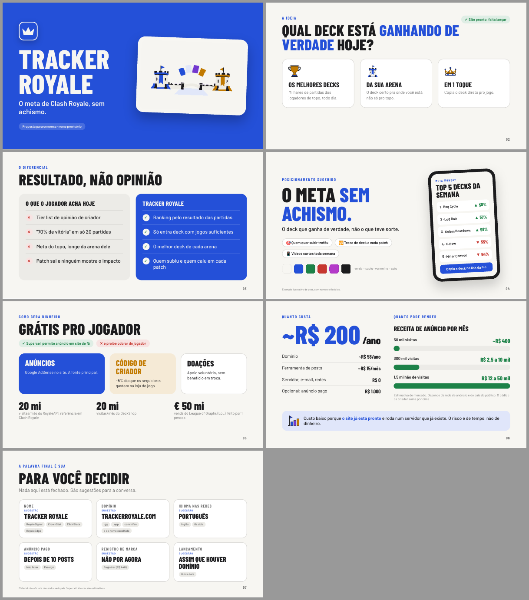

# 🎨 Apresentação PDF (`apresentacao_pdf`)

Gera apresentações em PDF com cara de Canva (slides 16:9, blocos de cor, números grandes, artes) a partir de um arquivo `.toml` simples. Nada de editor visual: você escreve o texto, o visual sai pronto.



## Uso em 3 passos

```bash
python3 gerar.py novo minha_apresentacao          # 1. cria a pasta com um modelo pronto
#                                                  # 2. edite minha_apresentacao/slides.toml
python3 gerar.py minha_apresentacao/slides.toml   # 3. gera minha_apresentacao/slides.pdf
```

No Windows, troque `python3` por `python`.

Opções:

| Opção | O que faz |
|---|---|
| `-o saida.pdf` | escolhe o nome/lugar do PDF |
| `--abrir` | abre o PDF ao terminar |
| `--html` | guarda também o `.html`, pra ajuste fino à mão |

**Requisitos:** Python 3.11+ e Google Chrome, Chromium ou Edge instalados. Sem `pip install`. As fontes vêm do Google Fonts, então precisa de internet (sem ela, cai na fonte do sistema).

## Os 7 layouts

Cada `[[slide]]` no `.toml` é uma página e escolhe um `layout`. O `modelo/slides.toml` tem um exemplo comentado de cada.

| Layout | Pra quê | Campos principais |
|---|---|---|
| `capa` | abertura, fundo na cor principal | `titulo`, `subtitulo`, `selo`, `imagem` |
| `cards` | 2 a 4 cartões lado a lado | `rotulo`, `titulo`, `selo`, `cards = [{titulo, texto, icone}]` |
| `comparacao` | antes ✕ × depois ✓ | `antes = {titulo, itens}`, `depois = {titulo, itens}` |
| `frase` | frase de impacto + chips + paleta + celular ou imagem | `frase`, `sub`, `chips`, `cores`, `[slide.celular]` ou `imagem` |
| `blocos` | etiquetas pode/não pode + blocos coloridos + números | `etiquetas`, `blocos`, `numeros` |
| `numero` | número gigante + lista + barras de cenário | `valor`, `unidade`, `itens`, `faixa`, `[slide.lado]` com `barras` |
| `decisoes` | grade de decisões com sugestão e alternativas | `sub`, `itens = [{tema, sugestao, alternativas}]` |

Em qualquer slide: `rodape = "texto pequeno no canto"`. O número da página é automático (menos na capa).

## Texto e imagens

- `*assim*` fica na cor principal. `**assim**` fica em negrito. `\n` quebra linha (ex.: `titulo = "Tracker\nRoyale"`).
- Imagens: caminho relativo à pasta do `.toml` (`imagem = "capa.png"`). Todas são opcionais.
- Emoji funciona nos chips e selos (`"🎯 Público"`).

## Tema

No topo do `.toml`, tudo opcional:

```toml
[tema]
cor = "#2450d8"            # cor principal: capa, destaques, botões
fundo = "#f7f6f2"
texto = "#1c1c1e"
bom = "#1d8248"            # ✓ e "sobe"
ruim = "#c7372f"           # ✕ e "cai"
extra = "#c27a00"          # terceira cor dos blocos
fonte = "Barlow"           # qualquer fonte do Google Fonts
fonte_titulo = "Barlow Condensed"
logo = "logo.png"          # quadrado, aparece na capa
```

Os tons claros (fundos dos cartões, etiquetas) são derivados dessas cores sozinhos. Trocar `cor` repinta a apresentação inteira.

## Exemplo real

`exemplos/tracker_royale/` é a proposta do Tracker Royale para um stakeholder: 7 páginas, com as artes do site.

```bash
python3 gerar.py exemplos/tracker_royale/slides.toml
```

## Arquivos

```
apresentacao_pdf/
├── gerar.py          # o gerador (Python puro)
├── estilo.css        # o visual; as cores vêm do [tema]
├── modelo/           # o que o "novo" copia
└── exemplos/
    └── tracker_royale/   # slides.toml + artes + slides.pdf + previa.png
```
