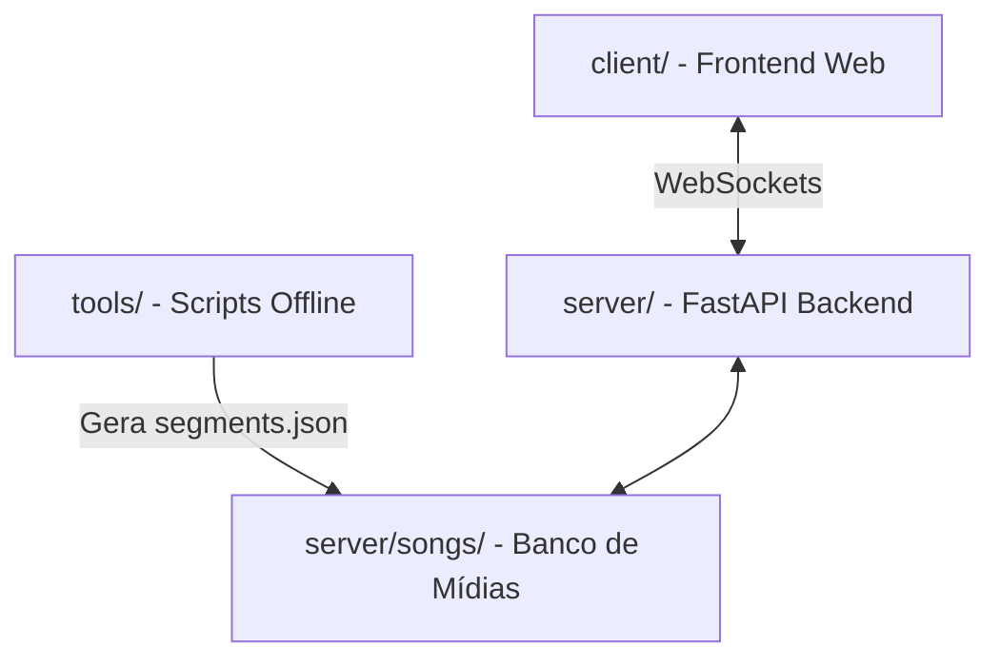

# Guia do Projeto Karaokê — Referência de Engenharia e Arquitetura

> [!IMPORTANT]
> **INSTRUÇÃO CRÍTICA PARA A IA ASSISTENTE:** 
> Este arquivo é a fonte da verdade para o ecossistema `karaoke/`. Sempre que uma pergunta for feita ou uma alteração for solicitada sobre a pasta `karaoke/`, este guia DEVE ser acessado e lido primeiro para garantir aderência estrita aos padrões arquiteturais, invariantes de dados e fluxos de rede estabelecidos.

---

## 🗺️ 1. Visão Geral do Sistema

O projeto é um sistema de Karaokê multi-dispositivo baseado em inteligência artificial para transcrição vocal e pontuação em tempo real. Ele é composto por três componentes principais:



1. **`client/`**: Interface web responsiva sem build step (Vanilla JS + ES Modules + CSS Puro) rodando dois papéis possíveis: **Display** (a TV do Karaokê) ou **Mic** (o celular pareado como microfone sem fio).
2. **`server/`**: API assíncrona FastAPI, servindo páginas estáticas, rotas de upload e um servidor de WebSockets de alto desempenho integrado com `faster-whisper` e heurísticas de scoring avançadas.
3. **`tools/`**: Utilitários de linha de comando para pré-processamento e alinhamento automatizado de músicas a nível de palavra (word-level alignment).

---

## 📂 2. Estrutura de Diretórios e Componentes

```
karaoke/
├── client/                     # Código da Interface do Usuário (Client-side)
│   ├── index.html              # Esqueleto: o servidor troca cada @include pelos parciais
│   ├── partials/               # Um arquivo por tela/modal (header, selection, game, mobile-mic, modals/*, templates, score-bars)
│   ├── assets/art/             # Artes SVG próprias (símbolo, textura de papel, pauta, estante vazia...)
│   ├── styles/
│   │   └── *.css               # Um arquivo por área (tokens, base, layout, songs, game, mobile-mic, modals, queue, states, tv)
│   └── js/
│       ├── main.js                                 # Bootstrap: identifica TV (display) ou celular (mic) e liga cada tela
│       ├── core/                                   # Base usada por todos: estado, config, DOM, ícones, tema, toast
│       │   ├── state.js                            # Objeto central de estado mutável compartilhado
│       │   ├── config.js                           # Parâmetros de URL, sala, papel e detecção de TV (isTvBrowser)
│       │   ├── compat.js                           # Polyfills para navegador de TV antigo (importado primeiro)
│       │   ├── dom.js                              # Cache de elementos do DOM via getters e overlay de carregamento
│       │   ├── html.js                             # escapeHtml: texto de usuário nunca vai cru para o HTML
│       │   ├── icons.js                            # Ícones próprios em SVG (<i data-icon> / iconSvg), sem emojis
│       │   ├── theme.js                            # Tema claro/escuro
│       │   ├── toast.js                            # Notificações (no celular só erros)
│       │   ├── public-origin.js                    # Endereço público para os QR Codes (KARAOKE_PUBLIC_URL)
│       │   └── wake-lock.js                        # Tela sempre acesa (celular e TV na partida)
│       ├── ui/                                     # Componentes de interface reaproveitados
│       │   ├── modal.js                            # Gerenciador único de modais (Esc, clique fora, voltar do navegador)
│       │   ├── select.js                           # Select personalizado (o <select> nativo segue por baixo)
│       │   ├── tabs.js                             # Helper de abas (data-tabs + aria-selected)
│       │   ├── tv-nav.js                           # Controle remoto: setas, OK, Voltar, Play/Pause
│       │   └── status-panel.js                     # Painel de saúde (clique no "Online")
│       ├── audio/                                  # Som e microfone
│       │   ├── audio-lifecycle-manager.js          # AudioContext, música, voz guia, tom e captura do microfone
│       │   ├── jungle.js                           # Pitch shifter (Web Audio API)
│       │   ├── mic-stream.js                       # Constraints de captura do microfone
│       │   ├── mic-status.js                       # Painel de microfones da TV
│       │   ├── guide-vocal.js                      # Voz guia: vocal separado baixinho, no tom do instrumental
│       │   ├── song-preview.js                     # Ouvir 12 s do refrão na lista
│       │   └── replay.js                           # Ouvir a própria apresentação (voz gravada + instrumental)
│       ├── net/                                    # Conexão com o servidor fora da partida
│       │   ├── ws-display.js                       # WebSocket da TV no lobby
│       │   └── sync.js                             # Sincronia de tempo e calibração de latência
│       ├── game/                                   # Tela de jogo da TV
│       │   ├── session.js                          # Início e fim da partida, áudio e WebSocket do jogo (reconexão)
│       │   ├── server-messages.js                  # Uma função por mensagem do servidor para a TV
│       │   ├── highlight-loop.js                   # Laço da letra: acende palavras, troca verso, conta o fim do solo
│       │   ├── lyrics-carousel.js                  # As quatro linhas da letra e o deslize entre versos
│       │   ├── hud.js                              # Nota do verso, nota geral, moldura, selo da vez, barras de progresso
│       │   ├── transcription.js                    # Faixa "Ouvi:" com acerto e erro por palavra
│       │   ├── game-over.js                        # Fim de jogo: rank ou pódio, recordes, botões de ouvir
│       │   ├── controls.js                         # Tom, velocidade, pausa, barra da música e modos
│       │   ├── score-bars.js                       # Barras de placar por time nas bordas
│       │   ├── verse-stamp.js                      # Carimbo por verso: Na mosca · Quase · Fora
│       │   ├── turns.js                            # Revezar versos (duelo): dono de cada verso
│       │   ├── lyrics-script.js                    # Japonês: original, romaji ou ambos
│       │   ├── game-events.js                      # Eventos do player para a gravação da partida
│       │   ├── combo.js                            # Combo: selo no palco (solo) e chip ×N nas barras
│       │   ├── reactions.js                        # Reações da plateia subindo na TV (coração, fogo, estrela)
│       │   └── share-card.js                       # Cartão 4:5 para print no fim de jogo (TV e celular)
│       ├── lobby/                                  # Antes da partida: repertório, lobby, fila e biblioteca
│       │   ├── selection-view.js                   # Repertório, busca e lobby da música (capa + cantor)
│       │   ├── lobby.js                            # Vagas de cantor: microfone próprio + time A–D
│       │   ├── queue-view.js                       # Fila de processamento (aba "Adicionar")
│       │   ├── requests.js                         # Fila da noite: "Próximas" na TV, "Pedir música" no celular
│       │   ├── cover-picker.js                     # Trocar a capa entre as opções encontradas
│       │   ├── youtube-search.js                   # Busca no YouTube pelo nome
│       │   ├── modals.js                           # Liga os três modais abaixo
│       │   ├── pairing-modal.js                    # QR Code e link de pareamento do celular
│       │   ├── add-song-modal.js                   # "Adicionar música" em três passos
│       │   └── lrc-editor-modal.js                 # Editor de meta.json e letra LRC
│       ├── players/                                # Cantores
│       │   ├── profile-view.js                     # Ranking e perfil (TV e celular)
│       │   ├── players-modal.js                    # Modal "Cantores" da TV
│       │   └── annotate.js                         # Anotar os próprios versos para calibrar a nota
│       ├── mobile/                                 # Celular-microfone
│       │   ├── mobile-mic-view.js                  # Tela do microfone: VU, captura e controles
│       │   ├── mic-socket.js                       # WebSocket role=mic e reconexão
│       │   ├── mic-messages.js                     # Uma função por mensagem do servidor para o celular
│       │   ├── mic-final.js                        # Placar final e os botões Cartão, Anotar e Ouvir
│       │   └── reactions-bar.js                    # Três botões de reação para quem está assistindo
│       └── worklets/
│           └── audio-processor.js                  # AudioWorklet: 16 kHz Int16 em pacotes KM01 de 100 ms
├── server/                     # Servidor HTTP / WebSocket e Engenharia AI (Server-side)
│   ├── main.py                 # Ponto de entrada leve (Uvicorn / FastAPI bootstrap)
│   ├── state.py                # Singletons compartilhados (evita imports circulares)
│   ├── rooms.py                # Modelagem da sala de canto (KaraokeRoom, RoomManager)
│   ├── song_manager.py         # Gerenciamento de pastas de música no disco
│   ├── score_engine.py         # Algoritmos de scoring, perdão de vazamento e normalização por idioma
│   ├── combo.py                # Combo: versos "Na mosca" (≥ 85) seguidos por cantor
│   ├── stt_engine.py           # Interface do Whisper, detecção de silêncio, CUDA fallback, duas passadas
│   ├── mic_stream.py           # Pacote KM01, relógio da música, janelas disjuntas por verso
│   ├── pitch.py                # Afinação (YIN): pitch.json e nota de tom por verso
│   ├── players.py              # Perfis, recordes e ranking (KARAOKE_PLAYERS_DIR)
│   ├── song_requests.py        # Fila da noite por sala ("quero cantar")
│   ├── recorder.py             # Gravação das partidas (formato 2: as duas passadas do Whisper)
│   ├── routes/                 # Handlers HTTP REST
│   │   ├── songs.py            # Listagem, reprodução de backing e deleção de músicas
│   │   ├── lyrics.py           # Endpoints de leitura/escrita de letras sincronizadas
│   │   ├── upload.py           # Pipeline de processamento de novos arquivos (3 fluxos)
│   │   ├── queue.py            # Fila de processamento (status traz alignment_busy = mutex de GPU)
│   │   ├── players.py          # /api/players, /api/players/{nome}, leaderboard da música
│   │   ├── recordings.py       # Gravações: gabarito dos versos e voz gravada
│   │   └── status.py           # /api/status (painel de saúde)
│   ├── ws/
│   │   └── room.py             # Endpoint WebSocket de orquestração de sala em tempo real
│   └── utils/                  # Biblioteca de helpers e adaptadores externos
│       ├── ffmpeg_bootstrap.py # Auto-detecção de FFmpeg no Windows (Winget/PATH)
│       ├── text.py             # Slugify robusto e interpretador de tempo flexível
│       ├── lrc.py              # Parsing leve de headers LRC ([ti:], [ar:])
│       ├── lrc_align.py        # Alinhador puro de letras planas vs Whisper
│       ├── lrc_pro.py          # MMS_FA linha por linha (janela do LRC) com confiança por palavra
│       ├── alignment_quality.py # Nota da sincronia → meta.json alignment_quality / needs_review
│       ├── segment_timing.py   # match_words_in_order + finalize_segments (versos sem sobreposição)
│       ├── separation.py       # Demucs (uma separação por vez), MP3 320k, instrumental normalizado
│       ├── loudness.py         # LUFS (BS.1770 em numpy) + limitador (~−16 LUFS)
│       ├── cover.py            # Capa: iTunes + Deezer + YouTube, nota por artista/título, escolhível
│       ├── song_paths.py       # safe_song_dir: slug do cliente nunca sai de songs/
│       ├── youtube.py          # Wrapper yt-dlp assíncrono com limpeza de residuais
│       └── prepare.py          # Adaptador dinâmico para invocar a tool prepare_song
├── tools/                      # Scripts auxiliares e automações
│   ├── prepare_song.py         # Alinhador word-level de áudio vocal com LRC para gerar segmentos
│   ├── generate_lrc.py         # Gerador de LRC via Whisper puro
│   ├── replay_recording.py     # Repassa uma partida gravada pelo Whisper com outros parâmetros
│   └── preview_front.py        # Front sem GPU, com dados de exemplo
└── docs/                       # Documentação técnica e especificações do projeto
    ├── architecture/           # Documentos de arquitetura e fluxos de rede
    │   ├── ARCHITECTURE.md     # Visão geral de componentes e dependências
    │   ├── FLOW.md             # Fluxos de processamento de músicas e API
    │   └── MULTIPLAYER_FLOW.md # Handshake e loops de multiplayer
    ├── guides/                 # Manuais operacionais e de calibração
    │   ├── PROJECT_GUIDE.md    # Este arquivo (guia principal / fonte da verdade)
    │   ├── LRC_ALIGNMENT_TUNING.md # Guia de solução e knobs de alinhamento
    │   ├── AUDIO_PIPELINE_MELHORIAS.md # Revisão do áudio: feito × a calibrar no servidor
    │   └── TODO_SERVIDOR_FINAL.md # O que validar no servidor com GPU
    └── archive/                # Documentos arquivados/históricos ou deprecados
        ├── PLANO.md            # [DEPRECADO] Planejamento original do MVP
        ├── notes.md            # [DEPRECADO] Rascunho inicial e problemas Holiday
        ├── BACKEND_REFACTOR_NOTES.md # [ARQUIVADO] Histórico de refatoração do server
        ├── LRC_ALIGNMENT_FIX.md # [ARQUIVADO] Notas sobre transição para word-level
        ├── FRONT_REDESIGN_2026-09.md # Histórico do redesign e dos recursos de festa
        └── holiday-green-day/  # Pasta de áudios/JSONs de depuração do Holiday
```

---

## ⚡ 3. Fluxos Críticos de Funcionamento

### A. Protocolo de Pareamento de Dispositivos (Multi-device)
Para parear a TV com o Celular sem necessidade de banco de dados persistente, o servidor FastAPI utiliza o modelo de sala `KaraokeRoom` mapeado por um ID de sala gerado no cliente e enviado via WebSockets.

```
Display Client               Server (ws/room.py)               Mobile Client
      |                              |                               |
      |-- WS (role=display) -------->|                               |
      |                              |                               |
      |                              |<-- WS (role=mic) -------------|
      |                              |                               |
      |                              |-- pairing_status (paired) --->|
      |<-- pairing_status (paired) --|                               |
```

*   **Invariante de Conexão**: Quando uma nova TV (`display`) se conecta na mesma sala (`room_id`), a anterior é fechada com o código **4001** ("outra tela assumiu"); quem recebe 4001 não reconecta (senão duas abas se derrubam em loop).
*   **Reconexão no meio da música**: a TV reconecta com `resume=1` e o servidor mantém placar, gravação e verso atual (não reenvia `start_game`). O celular que cai continua em `active_players`: registrando o mesmo apelido de novo, volta a pontuar.
*   **Apelidos**: até 15 caracteres imprimíveis; "Ana" e "ana." são o mesmo perfil (comparação pelo nome da pasta, sem caixa).

### B. Transmissão e Processamento de Áudio
Durante o canto, o fluxo de processamento e avaliação de áudio assíncrono segue o ciclo:

```
Mobile Client / PC Mic         Server WS (ws/room.py)         Score & STT Engines
         |                                |                            |
         |-- Pacote KM01 (Int16 16 kHz) ->|                            |
         |   (Acumula nos buffers)        |                            |
         |                                |                            |
         |-- Text (playback_time) ------->| (Checa fim de segmento)    |
         |                                |                            |
         |                                |-- Assíncrono (Thread) ---->| (Resample 16k)
         |                                |                            | (Whisper STT)
         |                                |                            | (Fuzzy Score)
         |                                |<-- Retorna Score / Text ---|
         |                                |                            |
         |<-- segment_result -------------|                            |
         |    (Texto acústico + %)        |                            |
```

1.  **Captura**: O microfone ativo captura áudio. O `AudioWorklet` filtra, reamostra para 16 kHz Int16 e envia pacotes `KM01` de 100 ms com o índice da primeira amostra (contador contínuo desde o início da captura).
2.  **Linha do Tempo**: O servidor (`mic_stream.py`) converte índice → tempo da música com uma âncora por jogador (menor atraso observado, que descarta o jitter da rede). O `playback_time` da TV alimenta o `SongClock`, que detecta seek e pausa. Cada verso recorta a própria janela, disjunta das vizinhas: `[max(sing_start - 1.5s, fim da anterior), min(sing_end + 0.5s, início da próxima)]`.
3.  **Gatilho de Transcrição**: Assim que o tempo de reprodução passa do fim da janela, o verso é despachado — na hora, se o áudio de todos os celulares já cobre a janela; senão, depois da folga para pacotes atrasados (0,6 s a 2 s, acompanhando o atraso observado). No revezamento de versos, só o time dono do verso é pontuado. No `audio_ended`, os versos que ainda não fecharam são pontuados também. Resultados de uma partida anterior (que esperavam a GPU) são descartados por `room.game_id`.
4.  **Whisper**: O áudio já chega a 16 kHz e é transcrito pelo `stt_engine.py` (usando a letra esperada como `initial_prompt`; se as palavras vêm com confiança baixa, repete sem a dica — `pick_transcription`). As duas passadas vão para a gravação. Os tempos das palavras são convertidos de "relativo à janela" para "relativo ao `sing_start`" antes do score.
5.  **Cálculo do Score**: O resultado é comparado no `score_engine.py`, aplicando regras de **Fuzzy Matching**, **Perdão de Vazamento**, **Normalização por Idioma** (acentos, "tá/está", "pra/para", "à/a", números até 20, palavra partida pelo hífen) e **Sandwich Recovery**. Em paralelo, `pitch.py` compara a altura da voz com a melodia do vocal separado (`pitch.json`) e devolve "tom X%" — informativo, fora da nota até calibrar.
6.  **Retorno**: O resultado é transmitido via `broadcast()` simultâneo ao display (para atualizar a pontuação geral acumulada e destacar as palavras faladas/cantadas) e ao microfone (como feedback visual rápido).

### C. Pipeline de Upload de Música

> A interface usa só a fila (`POST /api/queue/add`): **fase 1** (download + Demucs + MP3 + `pitch.json`) roda na hora, mesmo durante uma partida; **fase 2** (gerar/alinhar a letra, Whisper/MMS_FA) espera a partida acabar. Enquanto a fase 2 (ou o salvar do editor, ou um reinstall) roda, `queue_manager.gpu_job()` segura o `whisper_lock` e a TV bloqueia o INICIAR ("GPU ocupada"); o servidor responde `start_blocked` a um `start_game`.

Ao adicionar uma música na interface, as rotas sob `routes/upload.py` executam operações encadeadas:
1.  **Conversão Slug**: Cria um ID seguro de URL convertendo `Título - Artista` para minusculizado e limpo (slug).
2.  **Aquisição de Áudio**: Baixa faixas separadas (Vocal e Instrumental) do YouTube via `yt-dlp`. Na interface o usuário **busca pelo nome** (`GET /api/youtube-search`, também via `yt-dlp`, sem download) e escolhe um resultado; colar o link continua valendo. O envio de arquivos locais saiu da interface (a rota ainda aceita).
3.  **Processamento e Alinhamento Temporal**: Os arquivos finais de áudio são processados e salvos como `vocal.mp3` e `backing_track.mp3`, garantindo perfeita sincronia instrumental. Os temporários pesados são deletados imediatamente.
4.  **Tratamento de Letras**:
    *   *LRC Pronto*: Salva o arquivo de sincronização `lyrics.lrc` e dispara `prepare_song`.
    *   *Letra Plana (Texto)*: Transcreve o vocal com o Whisper, extrai os timestamps e faz o alinhamento das palavras com a letra do usuário através de programação dinâmica e interpolação, gerando o arquivo `lyrics.lrc` para então rodar o `prepare_song`.
    *   *Whisper Puro (Sem Letra)*: Transcreve o áudio vocal e cria um rascunho de LRC estruturado com os timestamps da IA para edição manual subsequente.

---

## 📐 4. Invariantes de Dados e Regras de Negócio

### A. Banco de Mídias Local (`server/songs/`)
Cada música adicionada no sistema reside em uma pasta dedicada correspondente ao seu `slug` em `server/songs/<slug>/` e possui obrigatoriamente a seguinte estrutura de arquivos:
*   `meta.json`: Metadados operacionais de upload (URLs de origem, parâmetros de corte e sincronização).
*   `backing_track.mp3`: Áudio instrumental de acompanhamento sem voz principal.
*   `vocal.mp3`: Áudio da trilha de voz isolada (utilizada exclusivamente para o Whisper offline alinhar os timestamps).
*   `lyrics.lrc`: Letra da música com tags de tempo simplificadas por linha `[mm:ss.xx] Texto`.
*   `segments.json`: O arquivo de definição de jogabilidade. É gerado automaticamente pelo alinhador.
*   Opcionais: `cover.jpg` (+ `cover.options.json` com os candidatos e `cover.choice.json` quando alguém escolheu), `pitch.json` (melodia de referência, 10 ms por quadro), `.lyrics_edited` (a letra foi revisada no editor: o reinstall sem alinhamento forçado a mantém).
*   Campos do `meta.json` gerados pelo pipeline: `alignment_quality` (`{score, flags, lines}`), `needs_review` (nota < 70 → "Revisar" na lista) e `loudness` (`{lufs_before, gain_db}`).

### B. Contrato do Arquivo `segments.json`
O frontend lê e interpreta este arquivo JSON para orquestrar as telas, carrosséis de letras e sincronismo de canto. Cada entrada do array de segmentos deve obedecer rigorosamente a este formato:

```json
{
  "id": 1,
  "label": "Parte 1",
  "sing_start": 4.12,   // Início do canto do verso (segundos)
  "sing_end": 12.45,    // Fim do canto do verso (segundos)
  "pause_start": 12.45,  // Início da pausa instrumental subsequente
  "pause_end": 16.80,    // Fim da pausa instrumental
  "language": "pt",     // Idioma do verso (usado para calibração fonética e Whisper)
  "lyrics": "Letra completa do verso",
  "lyrics_timed": [     // Timestamps individuais por palavra
    {
      "word": "Letra",
      "expected_start": 0.05
    },
    {
      "word": "completa",
      "expected_start": 0.85
    }
  ]
}
```

*   **Regra de Monotonicidade**: Os tempos de `expected_start` em `lyrics_timed` devem ser **estritamente crescentes** e possuir uma diferença mínima de no mínimo `0.05s` (50ms) entre palavras consecutivas. Isso impede que palavras adjacentes acendam simultaneamente ou fora de ordem no frontend.
*   **Margem Vocal (Voice Delay)**: O alinhador reduz um atraso fixo de `400ms` da primeira palavra em relação ao áudio puro para dar margem de reação ao cantor, definindo o tempo da primeira palavra sempre como `0.05s`.
*   **Post-roll de Notas**: O tempo de `sing_end` ganha uma margem de `400ms` a mais após o término da última palavra transcrita para que o usuário possa sustentar e esticar notas longas finais.
*   **Versos sem sobreposição** (`segment_timing.finalize_segments`, aplicado no `prepare_song`, no PRO e na leitura pelo `song_manager`): `sing_end` cobre a última palavra e termina antes do `sing_start` do verso seguinte; nenhuma palavra passa do fim do verso.
*   **Campos opcionais do PRO**: `lyrics_timed[].confidence`, e por verso `confidence` e `align` (`window` = alinhado na janela da linha do LRC, `fallback` = distribuído por sílabas, `global` = música inteira).

### C. Regras de Design e Convenções do Frontend
*   **Bindings Imutáveis de Módulos ES**: Variáveis de estado mutável cruzado (ex: instâncias ativas de WS, timers de interface, caches de busca) não devem ser exportadas como `let` diretamente no nível do módulo. Use sempre o objeto central compartilhado `state` importado de `js/core/state.js` para mutações seguras (`state.propriedade = valor`).
*   **Separação de Estilo**: Nunca mude diretamente propriedades visuais do DOM via JavaScript (ex: `el.style.backgroundColor = 'red'`) para alterar estados visuais discretos. Crie classes de estado específicas no CSS da área (`styles/<área>.css`; visibilidade por estado em `styles/states.css`) (seguindo a convenção de nomenclatura BEM simplificada, como `.mic-badge--active`, `.btn-mobile-activate--muted`) e utilize estritamente a API `classList` do elemento no código JS para ativá-las ou desativá-las.
*   **Buildless**: O projeto é estritamente Vanilla JS. Não é permitida a adição de empacotadores (Webpack, Vite), superconjuntos (TypeScript) ou frameworks de terceiros.
*   **HTML em parciais**: `client/index.html` só tem `<!-- @include partials/... -->`; o `GET /` monta a página inteira (`server/utils/html_includes.py`) e entrega numa resposta só (bom para TV). IDs são contrato com o JS: mudou um, procure em `js/`.
*   **Compatível com TV antiga (Chromium 68+)**: JS até ES2018 — sem `?.`, `??`, `catch {}`, `toggleAttribute`; CSS sem `inset`, `:has()`. Polyfills em `js/core/compat.js`. Conferir: `for f in client/js/*.js; do npx -y acorn --ecma2018 --module --silent "$f" || echo "$f"; done`.
*   **Visual "partitura antiga"**: cores só por `var(--...)` de `styles/tokens.css` (pastéis + tinta sépia), cantos retos em tudo (`--radius: 0`).
*   **Fontes**: `--font-ui` (Inter, sans simples) para tudo que se lê — letra, títulos de música, notas, listas, formulários; `--font-display` (Lora) só no estético — marca, títulos de seção/modal, letra do rank.
*   **Ícones e emojis**: nenhum emoji na interface e nenhuma biblioteca de ícones. Ícone novo = novo path em `js/core/icons.js`, usado com `<i data-icon="nome">` ou `iconSvg('nome')`.
*   **Selects**: nunca o menu nativo; `js/ui/select.js` aprimora todo `<select>` no bootstrap. Mude o valor por `select.value = x` (o botão acompanha).
*   **Textos**: sem textos explicativos na interface; rótulos curtos. No celular os toasts são só de erro — validação ("faltou algo") usa `showToast(..., 'error')`.
*   **Navegação**: toda tela tem voltar (botão `Voltar`, seta nos modais, tecla Voltar do controle). Trocar de tela/aba ou abrir modal volta a rolagem ao topo (`setAppState`, `tabs.js`, `modal.js`).
*   **Preview sem GPU**: `python tools/preview_front.py [--host 0.0.0.0]` serve o front com dados de exemplo (sem WebSocket/áudio); `/?tv=1` força o modo TV, `/?role=mic&room=1234` o celular.

---

### D. Recursos de festa (TV + celulares)
*   **Lobby**: vagas com "+" (microfone próprio, time A–D; mesmo time = dupla/trio), "Sortear" e "Revezar versos". Forma de pontuação abaixo do quadro dos cantores. O mic da própria TV/PC aparece como **"Local"**.
*   **Revezar versos**: o k-ésimo verso com letra é do time `k % n` (`turns.js` × `ws/room.turn_owner`); a média de cada um é só sobre os próprios versos.
*   **Fila da noite**: mensagens `request_song` / `cancel_request` → `requests_update` (limites: 30 pedidos, 3 por cantor). No fim de jogo, "Próxima" com 10 s abre a música no lobby com quem pediu.
*   **Fim de jogo**: `game_over` traz `player_stats` (versos na mosca/quase/fora), `player_pitch`, `records` (recorde pessoal), `leaderboard`, `song_id`; a TV e cada celular montam o cartão para print e o "Ouvir".
*   **Perfis**: `players/<apelido>/profile.json` (`songs_sung[]` com `song_id`, `score`, `pitch`, `mode`, `date`).

## 🚀 5. Checklist para Modificações e Depuração

Sempre que realizar uma alteração no ecossistema, valide os seguintes tópicos antes de finalizar a atividade:

1.  [ ] **Front no preview**: mexeu em `client/`? Abra `tools/preview_front.py` no desktop e em largura de celular, rode a checagem ES2018 acima e `python -m pytest tests/ui` (Playwright).
1.  [ ] **Texto de usuário**: apelido, título, transcrição → `textContent` ou `escapeHtml`; slug de música → `safe_song_dir`.
1.  [ ] **Sem imports circulares**: Certifique-se de que nenhum import no backend foi feito diretamente entre `rooms`, `ws/room` ou as rotas. Qualquer singleton ou configuração de ambiente necessária deve ser importada de `state.py`.
2.  [ ] **Persistência e Fechamento**: Garanta que todas as tarefas assíncronas do Whisper (`asyncio.create_task`) em `room.py` tenham uma referência forte em `room.pending_tasks` para evitar coleta de lixo precoce e que sejam devidamente finalizadas (`await asyncio.wait_for`) ao receber a mensagem `"audio_ended"`.
3.  [ ] **Fallback de Hardware**: Ao mexer na engine de transcrição, certifique-se de que a captura de erros `cublas` e `cudnn` está funcional e que ela converte a instância para rodar na CPU caso a biblioteca de CUDA falhe na execução.
4.  [ ] **Liberação de Recursos de Áudio**: Ao alternar rotas no client ou resetar o gameplay, certifique-se de fechar as conexões antigas de WebSocket, parar loops de `requestAnimationFrame` (`cancelAnimationFrame(state.animationId)`) e encerrar instâncias do `AudioContext`.
